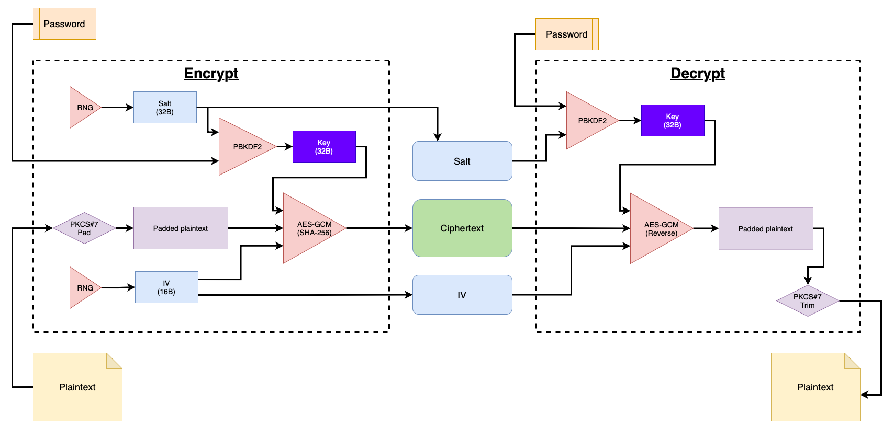

# 🔐 Portable Secret

Better privacy, without special software.

## TL;DR;

Portable Secret is a little hack that allows you to:

- Send encrypted messages/images/files over insecure channels (email, messaging, ...)
- Store sensitive information (passwords, documents) in insecure locations (web, Cloud drives, USB drives)

It's portable because: **decrypting these secrets does not require special software!**
All you need is a browser.

I created Portable Secret **to securely exchange documents via email with my mother**, who can't be expected to learn [PGP](https://en.wikipedia.org/wiki/Pretty_Good_Privacy), [age](https://github.com/FiloSottile/age), or similar.

I also use Portable Secret to store some my most sensitive secrets (private keys, 2FA recovery codes, etc.)

Finally, I use it to store copies of important documents (like a picture of passport). These documents are accessible to me from anywhere, **even if all my trusted devices have been stolen or lost**.

Sounds too good to be true? Keep reading. This is for you.

---

Portable Secret is not a product and it is barely a project.
**It is just a neat trick, a _hack_**.

The [source code](https://github.com/mprimi/portable-secret) and [creator tool](https://mprimi.github.io/portable-secret/creator/) are provided as a demonstration.

**Update January 2023**: [Rocky W.](https://www.rocky.dev/) took this idea and ran with it, creating a beautiful full-fledged product: [PrivacyProtect.dev](https://www.privacyprotect.dev/)

---

## How it works

A 'Portable Secret' is simply an HTML file that also contains:

- An encrypted payload
- Some Javascript that calls into the browser's [Web Cryptography APIs](https://developer.mozilla.org/en-US/docs/Web/API/Web_Crypto_API)

Any (reasonably modern) web browser can open the file, even without an internet connection!
If you know the password, you can recover the secret within.

[Here's an example](https://mprimi.github.io/portable-secret/examples/example-message.html) (the password is `banana`)

Notice that the file is self-contained and has no external dependencies!
It can be carried on a USB drive and decrypted without an internet connection, on any device that has a web browser.

To understand how it works, go ahead and [create yourself a secret](https://mprimi.github.io/portable-secret/creator/). Download and inspect the generated Portable Secret.

The embedded code is straightforward:

- Take the password and generate a key
- Use the key to decrypt the payload
- Display the decrypted secret

The current encryption implementation uses [AES-GCM](https://developer.mozilla.org/en-US/docs/Web/API/SubtleCrypto/encrypt#aes-gcm), generally considered the strongest option of the Web Crypto API due to its use of authentication to check that the ciphertext has not been modified by an attacker.

---

## How I use Portable Secret

### Private communication

Do you want to communicate privately with people, but you can't expect them to learn how to use PGP?

Send a Portable Secret. For example as email attachment.

> Hey \_\_\_, attached to this email is the PDF and data you requested, but it's encrypted. Never double-click on attachments, it's dangerous! Give me a call when you get this, and I'll show you how to read it.

Whenever they call me, I tell them:

> Right-click on the attachment and 'Open with...' any browser.
> The password is 'banana_split'.
> Now you can save the decrypted PDF.

### Store top-level secrets

Some secrets don't belong in your password manager. Things like backup private keys, 2FS recovery keys, wallet keys, safe combinations, treasure maps, etc.

Using Portable Secret, I can keep copies of these critical keys all over the place (Cloud drives, USB drives, all my devices, etc).

Even if some of these copies end up stolen (e.g. I lose a USB stick), I am not concerned anyone will be able to recover the secrets within.

The passwords are long sequence of words that are trivial for me to remember (thanks to the hints provided), but impossible for anyone else to guess or crack.

### Emergency documents on the go

Have you ever gotten stranded in a foreign country without any of your devices or documents? It's not fun.

I keep a copy of my passport encrypted on the internet. It's just an HTML file, it's easy to host. If I find myself stranded again, I can use any computer/device to retrieve it.

[Here's an example of ID document safely encrypted in plain sight](https://mprimi.github.io/portable-secret/examples/example-image.html).

---

## Cryptography

The following is a schematic representation of the encryption scheme implemented by the PortableSecret creator, as well as the decryption happening in the  PortableSecret itself.

This scheme and its parameters follow best practices and guidelines recommended by [NIST](https://www.nist.gov/cryptography) and [OWASP](https://owasp.org).

### Encryption

[`AES-GCM`](https://en.wikipedia.org/wiki/Galois/Counter_Mode) is used for Symmetric Authenticated Encryption.

 - Symmetric because the same key is used to encrypt and decrypt
 - *Authenticated* because it can verify the message **integrity** (if the ciphertext is tampered with, then it will fail to decrypt. As opposed to producing an invalid plaintext)

### Key derivation

[`PBKDF2`](https://en.wikipedia.org/wiki/PBKDF2) is used to turn a text password into an AES key.
The purpose of this module is slowing down dictionary-based brute-force attacks.

Unfortunately, the Web Crypto APIs do not support stronger KDFs such as [`scrypt`](https://en.wikipedia.org/wiki/Scrypt), [`bcrypt`](https://en.wikipedia.org/wiki/Bcrypt), or [Argon2](https://en.wikipedia.org/wiki/Argon2).

---

## Bounty: Crack me if you can

Do you think this cannot possibly be secure? Great, prove it.

[This secret](https://mprimi.github.io/portable-secret/examples/bounty.html) contains the recovery key for a Bitcoin wallet. Crack it and take my money!

---

## Miscellaneous

### Choosing a good password

Choosing a strong-enough password is key (pun intended).

Eventually I'll fill in this paragraph. For now all you get is the obligatory XKCD: [correct-horse-battery-staple](https://xkcd.com/936/)

### On tools

Portable Secret is a _tool_. As such, it can be used _wrong_ (e.g. weak password), or used to do bad things (e.g., exfiltrate intellectual property).

I cannot take responsibility for such misuse any more than a hammer manufacturer can take responsibility for me hammering my thumb, or using the hammer to attack someone.

### Prior art

I came up with Portable Secret on my own, but I have since found a few projects that do something similar.

[StatiCrypt](https://github.com/robinmoisson/staticrypt)

[PolySafe](https://github.com/fmeum/polysafe)

[`hscrypt`](https://smondet.gitlab.io/hscrypt/)

[Hypervault](http://hypervault.github.io)

[Encrypted HTML Vault](https://github.com/ccorcos/encrypted-html-vault)

[UltraCrypt](https://9p4.github.io/hackna/)

[html-vault](https://github.com/dividuum/html-vault)

[Password Protect My File](https://github.com/louissobel/ppmf)

[Emergency Contacts](https://github.com/jwillmer/emergency-contacts)

[Digi-Cloak](https://github.com/kaushalmeena/digi-cloak)

[Pretty Easy Privacy](https://prettyeasyprivacy.xyz/)

If you are aware of other similar/related projects, please let me know and I'll link them here.

### Feedback

I would love to hear what you think of this project, good, bad, or ugly.

Please use [GH issue](https://github.com/mprimi/portable-secret/issues) to report a problems and make suggestions. For everything else, start a [GH Discussion](https://github.com/mprimi/portable-secret/discussions).

You can also find my email on my homepage (linked from my GH profile).

Or discuss on [HackerNews](https://news.ycombinator.com/item?id=34083366)

## References

https://developer.mozilla.org/en-US/docs/Web/API/Web_Crypto_API

https://cheatsheetseries.owasp.org/cheatsheets/Password_Storage_Cheat_Sheet.html

https://cheatsheetseries.owasp.org/cheatsheets/Cryptographic_Storage_Cheat_Sheet.html

https://en.wikipedia.org/wiki/Galois/Counter_Mode

https://nvlpubs.nist.gov/nistpubs/Legacy/SP/nistspecialpublication800-38d.pdf

https://developer.mozilla.org/en-US/docs/Web/HTTP/Basics_of_HTTP/Data_URLs
